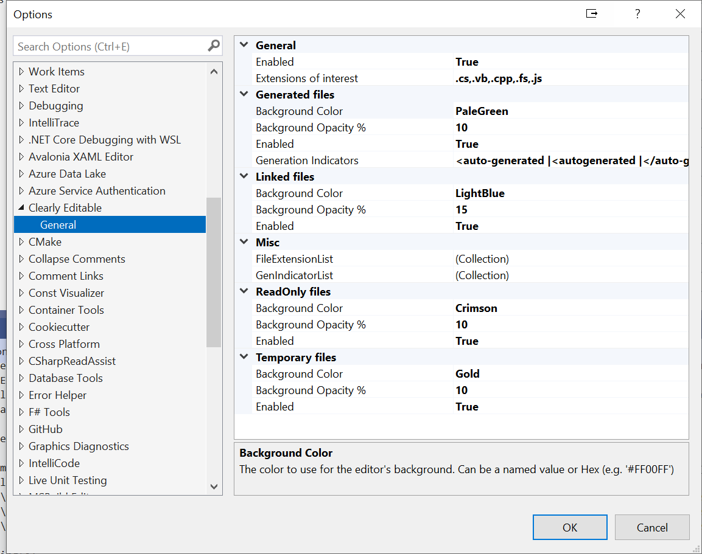

# Clearly Editable

A Visual Studio [2019](https://marketplace.visualstudio.com/items?itemName=MattLaceyLtd.ClearlyEditable2019) & [2022](https://marketplace.visualstudio.com/items?itemName=MattLaceyLtd.ClearlyEditable) extension to change the editor background color to show which documents can't or shouldn't be edited.

In the above, the left-most editor window is a generated file, the middle editor window is a read-only document, and the editor on the right is for a regular, editable file.

---
You chose the background colors (including transparency) for files that are generated, read-only, linked, or in a temporary directory.

